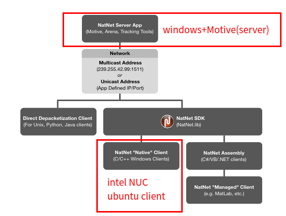

# NatNet_SDK_client

NatNet client is used to communicate with the NatNet server (Motive on Windows) within a local network.
  - As an evaluation tool for visual-inertial odometry (VIO), it supports saving trajectories as TUM-formatted files.
  - As an evaluation tool for VIO, it supports the visualization of motion capture (MoCap) trajectory results in ROS.



## Dependency

- cmake >= 3.5
- Eigen

## Build

```bash
cd natnet_client
mkdir build
cd build
cmake ..
make
```

## Usage

* Windows: OptiTrack Motive
* Ubuntu : Client

Simply run the following steps:

Step 1: (windows) Start the Motive software, load the calibration file, and check the status of rigid body tracking.

Step 2: (windows) Display the data streaming panel `View->dataStreaming` in Motive.

Step 3: (windows) Switch the Local Interface to Ubuntu and the local network of the host, then enable the Broadcast Frame Data option.

Step 4: (ubuntu) Configure the network connection with the host, and then set up a new connection. If it is a direct Ethernet connection, assign a static IP to Ubuntu that is in the same network as the host. If it is a connection within a wireless router LAN, manually or automatically configure the network for both Windows and Ubuntu on the Wi-Fi devices. 
Use `ifconfig` to check if the current IP address is in the same network as the host, and disable other network connections except for the current transmission network.

Step 5: (ubuntu) Start the client: 

```shell
cd ./natnet_client/build/
SERVER_IP="xxx.xxx.xxx.xxx" ./natnet_client
```


## Reference

[NatNet SDK](http://wiki.optitrack.com.cn/index.php/NatNet_SDK)