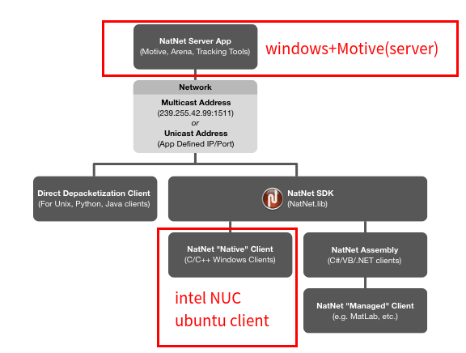

# NatNet_SDK_client

NatNet client, used to communicate with the NatNet server (Motive on Windows) within a local area network.
- [ros_node_verion](https://git.code.oa.com/robotics_x_vision/Optitrack_NatNet_client/tree/ros_node_version)
- [jamoca port](https://git.code.oa.com/robotics_x_vision/Optitrack_NatNet_client/tree/jamoca)
- [vision_localization](https://git.code.oa.com/robotics_x_vision/Optitrack_NatNet_client/tree/vision_localization)
  - As an evaluation tool for visual-inertial odometry (VIO), it supports saving trajectories as TUM-formatted files.
  - As an evaluation tool for VIO, it supports the visualization of motion capture (MoCap) trajectory results in ROS.



## Dependency

- cmake >= 3.5
- Eigen

## Build

```bash
git clone http://git.code.oa.com/robotics_x_vision/Optitrack_NatNet_client.git
cd natnet_client
mkdir build
cd build
cmake ..
make
```

## Usage

* windows: optitrack Motive 

* ubuntu : client

(windows) Start the Motive software, load the calibration file, and check the status of rigid body tracking.

(windows) Display the data streaming panel View->dataStreaming

<!--  -->

(windows) Switch the Local Interface to Ubuntu and the local network of the host, then enable the Broadcast Frame Data option.

(ubuntu)  Configure the network connection with the host, set up a new connection. If it is a direct Ethernet connection, assign a static IP to Ubuntu that is in the same network segment as the host. If it is a connection within a wireless router LAN, manually or automatically configure the network for both Windows and Ubuntu on the Wi-Fi devices. Use `ifconfig` to check if the current IP address is in the same network segment as the host, and disable other network connections except for the current transmission network segment.

(ubuntu) Start the client: 

```shell
cd ./natnet_client/build/
SERVER_IP="xxx.xxx.xxx.xxx" ./natnet_client
```

<!-- ## Structure

封装示例:

[example_main.cpp](src/example_main.cpp)

- optitack采用每帧定位数据触发回调函数的机制，以新开辟一个线程不断执行回调函数，故回调函数不应占用过长时间

- 封装类`Optitrack`的回调函数先对数据进行预处理，然后执行用户定义函数[optitrack_collect.cpp](src/optitrack_collect.cpp)=>`Optitrack::ProcessData()`

```c++
  /**
    * callback func within Datahandler
    *
    * You can process data here like publish/store...
    * if processing time will be much long, try to use another thread
    * store data in a class member queue (store rigid body data with certain ID reconmended )
    * for example:
    *      boost::lockfree::spsc_queue<MocapData, boost::lockfree::capacity<10> > queue;
    *      queue.push(data);
    *
    * @param data available mocap data
    */
  void ProcessData(const MocapData& data) {
    printf("Rigid Body [ID=%d  Error=%3.4f  frame=%ld]\n", data.id, data.mean_error, data.frame);
  }
```

```c++
struct MocapData {
  int id;             		 //rigid_body ID
  long frame;          	 	 //frame num
  double timestamp;     	 //timestamp of curr machine
  double latency_sec;   	 //latency_sec latency from camera capture to receive data
  double mean_error;         //err of localization
  Eigen::Matrix4f T;         //local pose reference to start pose frame
  Eigen::Matrix4f Global_T;  //global pose reference to Optitrack World frame(Y-UP)
}; 

```


Original example is in：

[SampleClient.cpp](samples/SampleClient/SampleClient.cpp) -->


## Reference

[NatNet SDK](http://wiki.optitrack.com.cn/index.php/NatNet_SDK)