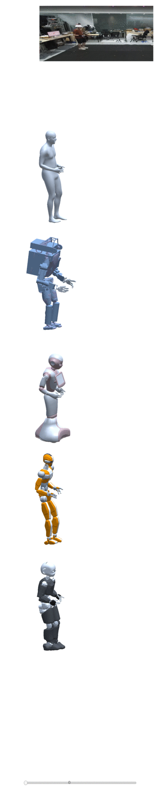

# Human Pose Extraction

## 1. Coarse human pose estimation
We use [mmhuman3d](https://github.com/open-mmlab/mmhuman3d/tree/main) to estimate the coarse human poses. 
1) Installation: please follow the [official getting started](https://github.com/open-mmlab/mmhuman3d/blob/main/docs/getting_started.md) for installation.  
2) H2TC data: Download h2tc data and fetch the `rgbd0` image folder. 
3) SMPL related resources and pretrained models: 
[SMPL](https://smpl.is.tue.mpg.de/) v1.0 and additional resources from [mmhuman3d](https://github.com/open-mmlab/mmhuman3d/tree/main) are used in this step. 
- [J_regressor_extra.npy](https://openmmlab-share.oss-cn-hangzhou.aliyuncs.com/mmhuman3d/models/J_regressor_extra.npy?versionId=CAEQHhiBgIDD6c3V6xciIGIwZDEzYWI5NTBlOTRkODU4OTE1M2Y4YTI0NTVlZGM1)
- [J_regressor_h36m.npy](https://openmmlab-share.oss-cn-hangzhou.aliyuncs.com/mmhuman3d/models/J_regressor_h36m.npy?versionId=CAEQHhiBgIDE6c3V6xciIDdjYzE3MzQ4MmU4MzQyNmRiZDA5YTg2YTI5YWFkNjRi)
- [smpl_mean_params.npz](https://openmmlab-share.oss-cn-hangzhou.aliyuncs.com/mmhuman3d/models/smpl_mean_params.npz?versionId=CAEQHhiBgICN6M3V6xciIDU1MzUzNjZjZGNiOTQ3OWJiZTJmNThiZmY4NmMxMTM4)
- [Pretrained models](https://github.com/open-mmlab/mmhuman3d/blob/main/configs/spin/README.md) 

Download the resources and arrange them like:

```text
mmhuman3d
├── mmhuman3d
├── docs
├── tests
├── tools
├── configs
└── data
    ├── gmm_08.pkl
    ├── body_models
    │   ├── J_regressor_extra.npy
    │   ├── J_regressor_h36m.npy
    │   ├── smpl_mean_params.npz
    │   └── smpl
    │       ├── SMPL_FEMALE.pkl
    │       ├── SMPL_MALE.pkl
    │       └── SMPL_NEUTRAL.pkl
    ├── pretrained
    │   └── spin_pretrain.pth
    └── static_fits
        ├── coco_fits.npy
        ├── h36m_fits.npy
        ├── lspet_fits.npy
        ├── lsp_fits.npy
        ├── mpii_fits.npy
        └── mpi_inf_3dhp_fits.npy
```

To extract human poses from the input images or video with the human tracking and pose estimation, you can `cd mmhuman3d` and run:
```
python demo/estimate_smpl.py configs/spin/resnet50_spin_pw3d.py data/checkpoints/spin_pretrained.pth --multi_person_demo --tracking_config demo/mmtracking_cfg/deepsort_faster-rcnn_fpn_4e_mot17-private-half.py --input_path L:/h2tc_dataset/002870/processed/rgbd0 --show_path vis_results/002870.mp4 --smooth_type savgol --speed_up_type deciwatch --draw_bbox --output vis_results/
```
The human poses are stored in folder `vis_results/inference_result.npz` with smpl format. 

## 2. Multi-modal based human pose optimization
### Steps:
1. Installation:
```
conda create -n pose python=3.7
conda activate pose
conda install pytorch==1.6.0 torchvision==0.7.0 cudatoolkit=10.1 -c pytorch
pip install matplotlib, opencv-python,scikit-learn,trimesh,Pillow,pyrender,pyglet==1.5.15,tensorboard,git+https://github.com/nghorbani/configer,torchgeometry==0.1.2,smplx==0.1.28
```
2. Download [smplh](https://mano.is.tue.mpg.de/)
3. File structure:
    ```
    pose_reconstruction_frommm
    |--config.py
    |--fitting_utls.py
    |--h2tc_fit_dataset_mm.py
    |--motion_optimizer.py
    |--run_fitting_mm.py
    |--smplh_male.npz       # smplh model (male)
    |--fit_h2tc_mm.cfg      # config file
    ```
4. Run the multi-modal optimizer to optimize the human poses with the optitrack data and glove hands.

```pyhton
python pose_reconstruction_frommm/run_fitting_mm.py @./fit_h2tc_mm.cfg --data-path <h2tc_takeid_processed_folder> --mmhuman <mmhuman_file> --out <out_pose_folder>
```

- `<h2tc_takeid_processed_folder>`: the processed folder, like `root/002870/processed/rgbd0`.

- `<mmhuman_file>`: the coarse pose file extracted from [Coarse human pose estimation](Coarse-human-pose-estimation), like `root/vis_results/inference_result.npz`

- `<out_pose_folder>`: folder path to save the optimization pose results. The output meshes are saved in `<out_pose_folder>/body_meshes_humor`. Optimized human poses are saved in `<out_pose_folder>/results_out/stage2_results.npz`  

### Optimization Algorithm:
Due to inevitable visual occlusion, the results of [mmhuman](https://github.com/open-mmlab/mmhuman3d/tree/main) are coarse, especially in arms and hands. Taking into account the multi-modal data collected in our dataset, including OptiTrack, gloves poses, rgb images and so on, these information can help us optimize the [mmhuman](https://github.com/open-mmlab/mmhuman3d/tree/main) results.    

Given the coarse [mmhuman](https://github.com/open-mmlab/mmhuman3d/tree/main) pose estimation $\mathcal{M_{mmh}}$, OptiTrack head and hands tracking points $\mathcal{H}$  and glove hands poses $\Theta_{hand}$, we aim to recover the accurate human poses $\mathcal{M_{acc}}$. Our optimization objective is: 

```math
\min _{\mathcal{M}_{acc} } \mathcal{C}_\text{trk} + \mathcal{C}_\text{wst} +\mathcal{C}_\text{smo}
```

The OptiTrack term $\mathcal{C}_\text{trk}$ measures how well the posed body model match the OptiTrack points $`\mathbf{P}_t = \left \{ \mathbf{d}_t^i \right \}_{i=0}^{3}`$ for head and two-hand points at each frame $t$. We use the mesh corresponding vertices $\mathbf{V}_t$ (index 411 for the head OptiTrack data, 5459 for the right hand aand 2213 for the left hand) to compute 

```math
\mathcal{C}_\text{trk} =\lambda _\text{trk}\sum_{t=0}^{T}\sum_{i=0}^{3} \mathop{\min}_{\mathbf{v}_t^i}\left \| \mathbf{v}_t^i- \mathbf{d}_t^i \right \| ^2
```

<!-- $\mathcal{C}_\text{trk} =\lambda _\text{trk}\sum_{t=0}^{T}\sum_{i=0}^{3}\omega_b  \mathop{\min}_{\mathbf{v}_t^i}\left \| \mathbf{v}_t^i- \mathbf{d}_t^i \right \| ^2$.  -->

<!-- $\omega_b$ is the robust bisquare weight based on the Chamfer distance.   -->

The wrist cost $\mathcal{C}_\text{wst}$ is used to disambiguate the right/left wrist pose guided by hands tracking information. Meanwhile, the cost also contributes to recovering accurate whole-arm poses even in severe occlusions.   We use the hand OptiTrack pose $`\mathbf{O}_t^{\text{hand}} = \left \{ \mathbf{o}_t^h \right \}_{i=0}^1`$ to calculate the right $h=0$ and the left $h=1$ wrist loss. It is formulated as 

```math
\mathcal{C}_\text{wri} =\lambda _\text{wri}\sum_{t=0}^{T}\sum_{h=0}^{1}\left \| {\mathbf{v}_\text{wri}}_t^h-\mathbf{o}_t^h \right \| ^2
```

where ${\mathbf{v}_\text{wri}}_t^h$ is the SMPLH right/left wrist pose.   

Independent frame-by-frame pose estimation always causes temporal inconsistency. The regularization term $\mathcal{C}_\text{smo}$ is used to guarantee the smoothness of the motion recovering and keep it reasonable. 
The smooth term encourages the 3D joints consistency. It is formulated as 

```math
\mathcal{C}_\text{smo}= \sum_{t=1}^{T}
(\lambda_\text{jp}\sum_{j=1}^{N} \left \| \mathbf{J}_t^j - \mathbf{J}_{t-1}^j \right \|^2   
+\lambda_\text{bl}\sum_{i=1}^{B} ( l_t^i - l_{t-1}^i )^2
)
```

$\mathbf{J}_t$ is the joint position at time $t$.
Bone lengths $l_t^j$ are from $\mathbf{J}_t^j$ at each step. 

For hands pose, we already have captured the two hands poses $\Theta_{hand}$ in each capturing. We map them to SMPLH hands pose directly. 

We initialize the optimization processing with the mmhuman poses. All $\lambda$ are weights to decide the contribution of each term.   

# Retargeting
## 1. Smplh sequence pose -> General format animation (.fbx)
### Steps:
1. Installation: 
   a. Install [Python FBX](https://download.autodesk.com/us/fbx/20112/fbx_sdk_help/index.html?url=WS1a9193826455f5ff453265c9125faa23bbb5fe8.htm,topicNumber=d0e8312).
    b. Open `SMPL-to-FBX-main` and `pip install -r requirements.txt`
2. SMPLX fbx: 
   Download the [SMPLX fbx model](https://smpl.is.tue.mpg.de) for unity. Keep the female model `smplx-female.fbx` and male model `smplx-male.fbx`.
3. Here's the file structure:
    ```
    SMPL-to-FBX-main
    |--Convert.py
    |--SMPLXObject.py
    |--FbxReadWriter.py
    |--<smplh_pose>/
    |  |--*.npz
    |--<fbx_path>/
    |  |--smplx-female.fbx
    |  |--smplx-male.fbx
    |--<output_path>/
    ```
4. Run `python Convert.py --input_motion_base <smplh_pose> --fbx_source_path <fbx_path>/smplx-female.fbx --output_base <output_path>` to start converting. The animation file will be saved in `<output_path>`. You can open it via Blender or Unity 3D.

## 2. Retargeting 
We use Unity 3D (2022.3.17) to demo the retargeting. 
Plese check the [tutorial video](https://www.youtube.com/watch?v=BEZHVYk6Fa4) first, then you can follow the steps:
<!-- 1. Model rigging: give an artist a mesh model, ask him to bound the mesh vertices to bones (it is called rigging in graphics) -->
1. Model rigging: given a mesh model, bound the mesh vertices to bones
2. Specifying the corresponding skeleton joints between rigged model A and B: Unity 3D automatically solves it after setting the rigged models as `humanoid` in `animation type`.
3. Animation: please follow the above tutorial video. The animation algorithm used in Unity 3D is [Linear Blend Skinning (LBS)](http://graphics.cs.cmu.edu/courses/15-466-f17/notes/skinning.html). 





